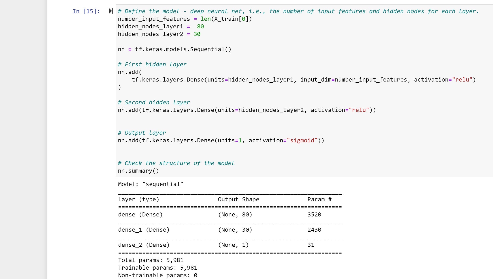

# Neural_Network_Charity_Analysis-

Overview of the analysis

The purpose of the anaysis is to create a binary classifier that is capable of predicting whether applicants will be successful if funded by Alphabet Soup. Using the dataset from the Alphabet Soup’s business team.

## Results

### Data Preprocessing

The target variable is "IS_SUCCESSFUL"

The other beneficial columns are the feature variable

EIN and NAME are neither targets nor features, and should be removed from the input data

### Compiling, Training, and Evaluating the Model

I selected 2 neurons, 2 layers and relu and sigmoid activation functions  

I was not able to achieve the 75% target performance 

I created new models three different times and I was able to get a better performance with model accuracy increasing from 58% to 63%

## Summary: 

I avoided the problem of over-fitting by making sure I did not exceed a maximum of 3 layer, I also increased my number of neurons to achieve increased performance for my model. I will suggest doing the following to get a better model performace:

a. Increase the number of neurons

b. Add more layers

c. remove non benefitial columns from the input data
